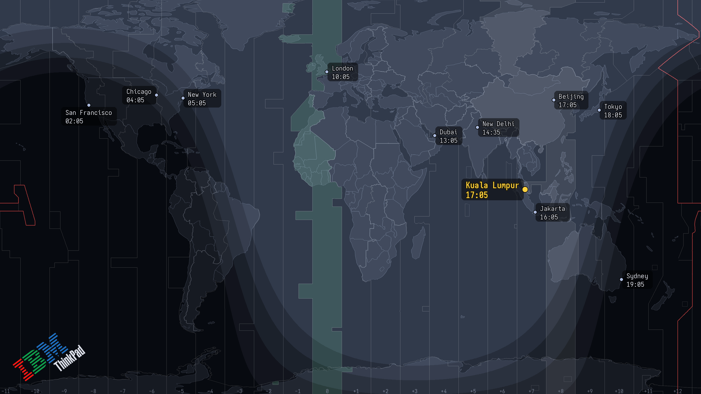
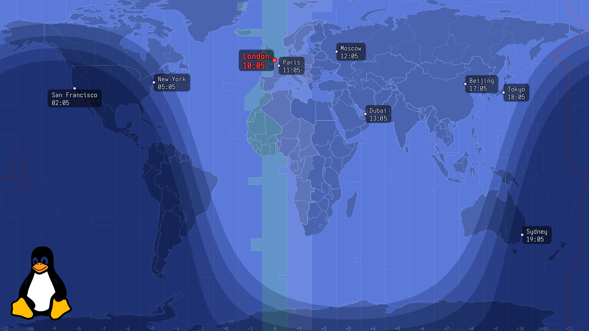
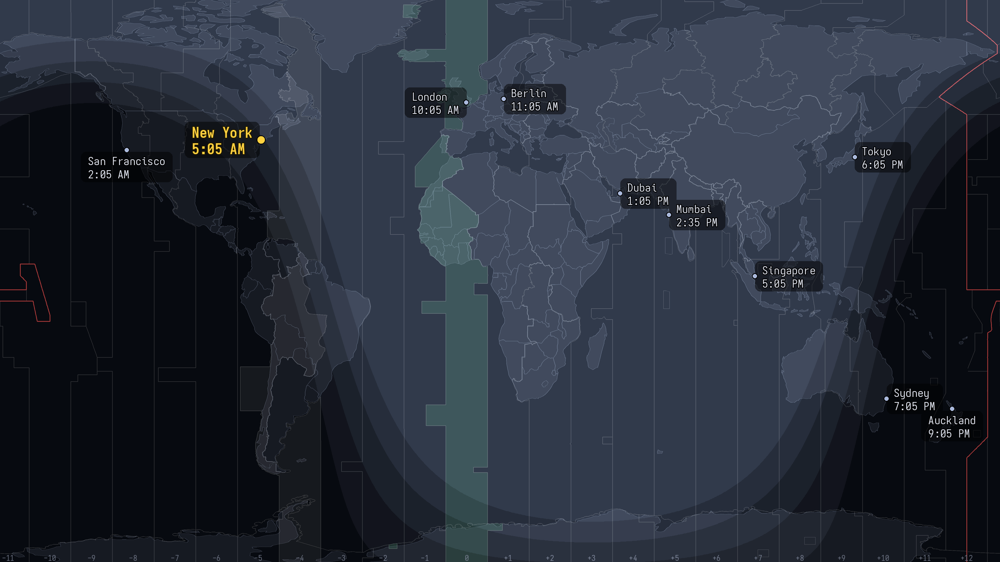

# greyline

[](https://github.com/cothinking-dev/greyline/actions/workflows/ci.yml)
[](LICENSE)

A live world-time desktop wallpaper for Wayland/X11 — a world map with clocks for
your cities, your home city highlighted, and a day/night terminator that tracks the
sun. A modern recreation of the classic IBM/ThinkPad **"World Time"** Active Desktop.

*(greyline = the ham-radio term for the day/night terminator.)*



<sub>Shown with the optional ThinkPad wordmark (a user-supplied logo — see [Licensing](#licensing--credits)). The bundled default logo is Tux.</sub>

It doesn't run a browser or a background daemon. A small Python program renders a PNG
once a minute and hands it to your existing wallpaper mechanism, then exits — so it's
effectively free on battery.

```
systemd timer (*:*:00) ─▶ greyline (renders in well under a second, then exits)
      render per output (Pillow): map + clocks + terminator
      └─▶ set wallpaper via the detected backend (sway/swww/hyprpaper/feh)
```

## Features

- **Multi-timezone clocks** at each city's real location, with **accurate DST** via the
  OS IANA database (`zoneinfo`). 12h or 24h.
- **Home city** accented (dot + bold label + optional timezone-column highlight),
  auto-detected from your system timezone or pinned in config.
- **Analytic day/night terminator**, seasonally correct, with discrete civil / nautical /
  astronomical **twilight bands**.
- **Vector map** drawn from public-domain **Natural Earth** data — crisp at any
  resolution, fully themeable (`dark`, `blue`, or custom), with honest zig-zag timezone
  boundaries, a green GMT column, and a red International Date Line.
- **Any resolution / multi-monitor / HiDPI** — each output rendered at native pixels.
- **Swappable corner logo** — ships with Tux; point `logo_path` at your own PNG.
- **Pluggable backends**, auto-detected: `sway`, `swww`, `hyprpaper`, `x11` (feh/xwallpaper),
  plus a generic `command` backend for **GNOME / KDE / XFCE** and anything else.

| `blue` theme + Tux | minimal (no logo, 12h) |
|---|---|
|  |  |

## Install

### Nix (flake + home-manager) — recommended

```nix
# flake.nix
inputs.greyline.url = "github:cothinking-dev/greyline";

# home-manager
imports = [ inputs.greyline.homeManagerModules.default ];

services.greyline = {
  enable = true;
  backend = "sway";              # or "auto" / "swww" / "hyprpaper" / "x11"
  fontFamily = "Aporetic Sans";  # resolved via fontconfig
  settings = {
    theme = "dark";
    format = "24h";
    twilight = { bands = true; darkness = "subtle"; };
    home = { tz = "auto"; column_highlight = true; };  # "auto" = system tz
    city = [
      { name = "Kuala Lumpur"; lat = 3.14;  lon = 101.69; tz = "Asia/Kuala_Lumpur"; }
      { name = "London";       lat = 51.51; lon = -0.13;  tz = "Europe/London"; }
      { name = "New York";     lat = 40.71; lon = -74.01; tz = "America/New_York"; }
      { name = "Tokyo";        lat = 35.68; lon = 139.69; tz = "Asia/Tokyo"; }
    ];
  };
};
```

Try it without installing:

```sh
nix run github:cothinking-dev/greyline -- --out wt.png --res 2560x1440   # writes a PNG
uvx greyline --out wt.png --res 2560x1440                                # same, via PyPI
```

### pipx / uv (any distro, any desktop)

```sh
pipx install greyline    # or: uv tool install greyline
greyline init            # detect your desktop, write a config, schedule updates
```

`greyline init` does everything the old manual setup did: writes a starter
`~/.config/greyline/config.toml`, auto-detects your compositor/desktop and picks the backend
(on **GNOME / KDE / XFCE** it fills in the right `command` recipe for you), and — where systemd
is present — installs and enables the once-a-minute user timer. No `git clone`, no hand-copied
units.

Tweak it from the CLI afterwards (comments in the file are preserved), or edit the file directly:

```sh
greyline city add "London" 51.51 -0.13 Europe/London --home
greyline city list
greyline config set theme blue
greyline config set twilight.darkness dramatic
greyline doctor          # detected backend, outputs, timer status
```

**No systemd?** Every init system / WM works — skip the timer and add greyline to your session
autostart instead:

```sh
greyline watch           # renders + applies every minute in the foreground
```

### Desktop environments (GNOME / KDE / XFCE / other)

On desktops that manage their own wallpaper (GNOME, KDE Plasma, XFCE), `greyline init` sets up
the generic `command` backend for you: greyline renders a PNG and runs a command to set it as
your wallpaper.

> **Note:** this **replaces** your desktop wallpaper — it is not an overlay. greyline re-renders
> and re-sets it each minute; the last image stays after greyline stops.

The command recipes are **best-effort / community-verified** — the maintainers run sway and
can't test them directly. If yours needs a different command, set it with
`greyline config set command '…'`, and please
[open a desktop-compatibility report](https://github.com/cothinking-dev/greyline/issues/new?template=desktop-compat.yml)
— that's how they get fixed. Raw recipes and by-hand setup are in [Advanced](#advanced).

## Configuration

`greyline config` and `greyline city` edit `~/.config/greyline/config.toml` for you (preserving
comments); you can also edit the file directly — the shipped
[`worldtime/default-config.toml`](worldtime/default-config.toml) is the documented template.
Keys: `backend`, `command`, `resolution`, `map_style` (`vector`/`raster`), `theme`
(`dark`/`blue`), `format` (`24h`/`12h`), `logo` / `logo_path` / `logo_invert`,
`[twilight] bands/darkness`, `[home] tz/column_highlight/color`, and a `[[city]]` list
(`name`, `lat`, `lon`, `tz`, optional `label_side`).

## CLI

```
greyline                          # render all outputs and apply (what the timer runs)
greyline init                     # first-time setup: config + backend + scheduling
greyline watch [--interval SEC]   # render+apply on a loop (any init system / WM)
greyline config set <key> <val>   # also: get [key] / unset <key>   (edits the config file)
greyline city add "<name>" <lat> <lon> <tz> [--home]   # also: list / remove "<name>"
greyline enable | disable | status   # manage the systemd user timer
greyline doctor                   # detected backend, outputs, session, timer
greyline --list-outputs           # show detected backend + outputs
greyline --out wt.png --res 1920x1200   # render a PNG, no backend needed
greyline --backend swww           # force a backend
```

## Advanced

**Set the backend by hand.** `greyline init` auto-configures it, but you can too. For
GNOME/KDE/XFCE the `command` backend runs a shell command with `{path}` (the PNG) and `{output}`
substituted (`greyline config set backend command`, then `config set command '…'`):

```toml
backend = "command"
# resolution = "2560x1440"   # optional; else largest xrandr output, else 1920x1080
# GNOME (empty-then-set defeats GNOME's same-URI cache; sets light + dark):
command = 'gsettings set org.gnome.desktop.background picture-uri "" && gsettings set org.gnome.desktop.background picture-uri "file://{path}" && gsettings set org.gnome.desktop.background picture-uri-dark "file://{path}"'
# KDE Plasma:
command = 'plasma-apply-wallpaperimage {path}'
# XFCE (the monitor segment varies — see: xfconf-query -c xfce4-desktop -l | grep last-image):
command = 'xfconf-query -c xfce4-desktop -p /backdrop/screen0/monitor0/workspace0/last-image -s {path}'
```

Test once with `greyline --backend command --command '…'` before scheduling.

**Set up systemd by hand.** `greyline enable` writes and enables the user timer. To do it
yourself, the units are in [`systemd/`](systemd/):

```sh
install -Dm644 systemd/greyline.{service,timer} -t ~/.config/systemd/user/
systemctl --user daemon-reload && systemctl --user enable --now greyline.timer
```

## How it works

- `geo.py` / `vectormap.py` — lon/lat → pixel projection; the vector map is drawn from
  Natural Earth GeoJSON (supersampled for smooth coastlines).
- `sun.py` — subsolar point + terminator/twilight boundary latitudes.
- `render.py` — composites map + overlays, then draws clocks at native resolution with
  smart label placement (labels pick a side to avoid overlapping each other and the edges).
- `backends/` — the only platform-specific code; everything else is portable.

## Licensing & credits

Code is **GPL-2.0-or-later**. It descends from Maxim Proskurnya's GPL "World Time
Wallpaper" tribute; the concept and original artwork are © IBM/Lenovo.

The default **vector** map uses public-domain **Natural Earth** data, and the default
logo is **Tux** (Larry Ewing / GIMP) — both cleanly redistributable. The original
IBM/Lenovo ThinkPad raster art and wordmark are **not** bundled; `map_style = "raster"`
and the ThinkPad logo require you to supply those files yourself (see
[`NOTICE`](NOTICE) and [`docs/CREDITS.md`](docs/CREDITS.md)).

greyline is a **personal passion project**, built and maintained in spare time and released as
**free and open-source software** (GPL-2.0-or-later). It's a labour of love, not a product —
issues, desktop-compatibility recipes, and pull requests are all welcome.

> Built with the assistance of AI coding tools.
